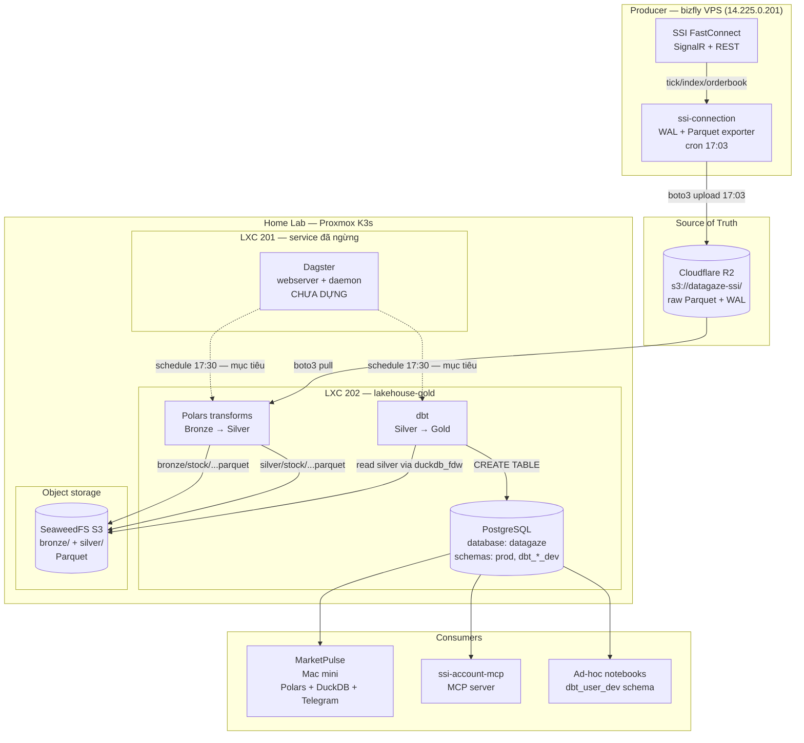

# Architecture Overview — DataGaze Data Platform

| Field        | Value                                               |
|--------------|-----------------------------------------------------|
| Owner        | `@hoangnguyen` (Platform)                           |
| Last Updated | 2026-08-05                                          |
| Version      | 1.1                                                 |
| Status       | Draft                                               |
| Scope        | `data-lakehouse` + `data-pipeline` (runtime)        |
| Supersedes   | —                                                   |

> Ground truth: [ADR 2026-04-13 — Platform Decisions](./adr/2026-04-13-platform-decisions.md) (D1–D7),
> phần orchestration thay bởi [ADR 2026-08-05 — Gỡ Prefect, chuyển sang Dagster](./adr/2026-08-05-retire-prefect-adopt-dagster.md).
> Tài liệu này mô tả kiến trúc đã chốt; mọi mâu thuẫn với ADR phải được giải quyết bằng cách update ADR trước, rồi mới sửa doc này.

> **Trạng thái tầng điều phối (2026-08-05):** không có scheduler nào đang chạy. Prefect đã gỡ
> sau 4 tháng với 0 flow run; Dagster chưa dựng. Mọi mốc giờ "17:30" dưới đây là thiết kế mục
> tiêu, chưa phải hành vi thực tế — hiện ETL chỉ chạy khi gọi tay qua CLI.

---

## 1. Executive Summary

DataGaze data platform là một medallion lakehouse quy mô home-lab: dữ liệu thị trường chứng khoán Việt Nam (SSI) được thu thập bởi `ssi-connection` trên bizfly VPS, đẩy lên **Cloudflare R2** làm single source of truth, rồi được `data-pipeline` (Polars + dbt, điều phối bằng Dagster — đang dựng) kéo về LXC `lakehouse-gold` để chuyển hóa qua 3 tầng Bronze → Silver → Gold. Consumer chính là `MarketPulse` (phân tích + Telegram). Throughput hiện tại ~50MB/day (stock), mở rộng sang BĐS và multi-domain trong các quý tới.

---

## 2. System Context

### Actors

| Actor                | Vai trò                                            | Loại       |
|----------------------|----------------------------------------------------|------------|
| SSI FastConnect API  | Nguồn dữ liệu tick/index/orderbook real-time       | Producer   |
| `ssi-connection`     | Service 24/7 trên bizfly VPS — WAL + Parquet + R2  | Producer   |
| `data-pipeline`      | Runtime logic: ingestion, Polars, dbt              | Processor  |
| `lakehouse-gold`     | LXC 202 Proxmox — Postgres Gold                    | Storage    |
| `MarketPulse`        | Analyst app (Mac mini) — Polars/DuckDB + Telegram  | Consumer   |
| `ssi-account-mcp`    | MCP server cho trading account (read Gold)         | Consumer   |
| Solo developer       | Operator (deploy, debug, schema evolution)         | Operator   |

### Flow tóm tắt

```
SSI ─► bizfly VPS (ssi-connection, cron 17:03) ─► Cloudflare R2 (SoT)
                                                        │
                                                        ▼
           lakehouse-gold (LXC 202) ◄── điều phối 17:30 (mục tiêu) ──┘
                │
                ├── Bronze (SeaweedFS) ── Polars ──► Silver (SeaweedFS)
                │
                └── dbt ──► Gold (Postgres `datagaze.prod`)
                                 │
                                 ▼
                        MarketPulse, ssi-account-mcp, ad-hoc notebooks
```

Điểm nhấn: **bizfly chỉ là producer**, không phải serving layer. Consumer không được đọc trực tiếp bizfly hay R2 ngoài `data-pipeline` — tránh coupling và egress fee surprise (xem [ADR D3](./adr/2026-04-13-platform-decisions.md#d3-ingestion-path)).

---

## 3. Component Diagram



---

## 4. Data Flow (End-to-End)

Chu kỳ production hàng ngày, phiên chứng khoán VN kết thúc 15:00:

1. **15:00–17:00 — Buffer & compact** (bizfly). `ssi-connection` flush WAL của phiên sang Parquet trong `~/Projects/SSI_Conection/data/export/{YYYY-MM-DD}/{channel}/{exchange}.parquet`. Volume điển hình ~50MB/day (xem `ssi-connection/ADR-011`).
2. **17:03 — R2 upload** (bizfly cron). Script push Parquet + WAL checkpoint lên `s3://datagaze-ssi/raw/{YYYY-MM-DD}/…`. R2 là SoT; bizfly có thể xóa local sau khi verify (WAL cleanup cron).
3. **17:30 — trigger pipeline** (mục tiêu; hiện chạy tay). Sẽ là schedule của Dagster trên LXC dành cho orchestration.
4. **Bronze ingestion** (Polars, LXC 202). Đọc R2 qua boto3, ghi as-is vào `s3://lakehouse/bronze/stock/{YYYY-MM-DD}/{channel}/{exchange}.parquet` trên SeaweedFS. Không mutate — Bronze là immutable replay layer.
5. **Silver transform** (Polars). Dedup theo `(symbol, trade_time, match_id)`, enforce schema, cast types, drop rows không hợp lệ. Ghi `s3://lakehouse/silver/stock/{YYYY-MM-DD}/...parquet`. Quality gate: row count delta vs Bronze < 5% (xem `CLAUDE.md` §Quality Gates).
6. **Gold transform** (dbt). dbt đọc Silver (via DuckDB/external table) và build models vào Postgres `datagaze.prod.*`. Các model gold bao gồm aggregate OHLC, intraday features, index snapshot. Sau `dbt run` là `dbt test` — fail thì pipeline run fail + Telegram alert (xem [ADR D7](./adr/2026-04-13-platform-decisions.md#d7-testing-strategy--không-cicd)).
7. **Consume**. `MarketPulse` query `datagaze.prod` (Polars read_database) để build daily report; `ssi-account-mcp` read-only cho account queries. Dev local dùng `dbt_{user}_dev` schema, không đụng `prod`.

**Failure modes**:
- Bronze fail → flow retry 3 lần, sau đó Telegram alert; data vẫn ở R2 (replayable).
- Silver/Gold fail → alert + skip publish; `prod` giữ nguyên state ngày hôm trước.
- R2 unreachable → pipeline fail ở step 4; bizfly vẫn buffer Parquet local, catch-up khi R2 phục hồi.

---

## 5. Technology Choices + Rationale

| Layer           | Choice                              | Rationale                                                                                                  | Link                                                                               |
|-----------------|-------------------------------------|------------------------------------------------------------------------------------------------------------|------------------------------------------------------------------------------------|
| Landing / SoT   | Cloudflare R2                       | Egress free, S3-compatible, đã là SoT của `ssi-connection`; decouple bizfly khỏi consumer                  | [ADR D3](./adr/2026-04-13-platform-decisions.md#d3-ingestion-path)                 |
| Object storage  | SeaweedFS (S3) trên K3s             | Self-host, S3 API, rẻ cho Parquet Bronze/Silver, không phụ thuộc vendor cho intermediate layer             | `CLAUDE.md` §Data Zones                                                             |
| Orchestration   | Dagster (chưa dựng) | Partition theo ngày + backfill sẵn có; asset graph khớp Bronze → Silver → Gold; asset check gắn quality check vào đúng bảng. Thay Prefect 3 — đã gỡ 2026-08-05 sau 4 tháng với 0 flow run | [ADR 2026-08-05](./adr/2026-08-05-retire-prefect-adopt-dagster.md) |
| Bronze → Silver | Polars                              | 10–50× nhanh hơn pandas cho workload Parquet; lazy API phù hợp 50MB/day và scale tới GB                    | [ADR D4](./adr/2026-04-13-platform-decisions.md#d4-orchestration--transform-stack) |
| Silver → Gold   | dbt-postgres                        | SQL-first, tests + docs + lineage; target-based schema (`prod` vs `dbt_{user}_dev`) tách env không cần 2 DB | [ADR D4](./adr/2026-04-13-platform-decisions.md#d4-orchestration--transform-stack), [D6](./adr/2026-04-13-platform-decisions.md#d6-schema-separation-cùng-postgres-khác-schema) |
| Serving (Gold)  | PostgreSQL (LXC 202 `lakehouse-gold`) | Transactional, đủ cho analytics < 100GB; indexed aggregate; consumer quen SQL                            | [ADR D2](./adr/2026-04-13-platform-decisions.md#d2-lxc-naming)                     |
| Repo layout     | 2 repo: `data-lakehouse` + `data-pipeline` | Tách infra (Terraform/Ansible/DDL) khỏi runtime (flows/transforms) để hạn chế drift            | [ADR D1](./adr/2026-04-13-platform-decisions.md#d1-tách-2-repo-rõ-vai-trò)         |
| Env separation  | Config-per-env (không tách folder)  | Industry pattern Y; `environments/{dev,prod}.env` + `make run ENV=prod`                                   | [ADR D5](./adr/2026-04-13-platform-decisions.md#d5-env-separation-2-envs-dev--prod) |
| Testing         | Pre-commit + in-flow `dbt test` + `make check` | Scale solo; CI/CD overhead không đáng; pre-commit là must-have, flow test bắt regression runtime  | [ADR D7](./adr/2026-04-13-platform-decisions.md#d7-testing-strategy--không-cicd)   |

---

## 6. Non-Functional Requirements

Target thực tế cho scale hiện tại (1 producer, ~50MB/day, home-lab):

| NFR                          | Target                                          | Ghi chú                                                                |
|------------------------------|-------------------------------------------------|------------------------------------------------------------------------|
| Ingestion freshness          | Gold sẵn sàng trước 18:00 cùng ngày (phiên 15:00) | End-to-end < 60 phút từ 17:00 EOD                                   |
| Daily data volume            | ~50MB/day Parquet raw (stock)                   | Nguồn: `ssi-connection` ADR-011                                        |
| Full daily pipeline latency  | < 30 phút từ trigger 17:30                      | Bao gồm Bronze + Silver + Gold + tests                                 |
| Query latency (Gold)         | p95 < 500ms cho aggregate theo ngày             | Postgres với index trên `(symbol, trade_date)`                         |
| Availability (Gold)          | 99% monthly (home lab SLA)                      | Chấp nhận maintenance window; không HA                                 |
| Recovery (replay từ R2)      | RPO = 1 day, RTO < 2h                           | R2 retain raw ≥ 90 days; backfill theo partition ngày (Dagster)             |
| Alert latency                | < 5 phút khi run fail                          | Dagster → Telegram bot                                                 |
| Concurrent consumers         | ≤ 5                                             | MarketPulse + mcp + vài notebook                                        |
| Schema change cadence        | ≤ 1/tuần                                        | Alembic migration cho Gold, dbt tests chặn breaking change             |

**Non-goals**: không target real-time intraday serving (ingest near-EOD); không HA Postgres; không multi-region.

---

## 7. Scalability Path

Phase hiện tại và ngưỡng kích hoạt scale-up:

| Phase       | Trạng thái   | Trigger scale                                                                 | Hành động                                                                                         |
|-------------|--------------|-------------------------------------------------------------------------------|---------------------------------------------------------------------------------------------------|
| **P0 Now**  | Đang chạy    | 1 domain (stock), 50MB/day, 1 consumer primary                                | Giữ nguyên: Postgres + SeaweedFS + một tiến trình điều phối                                          |
| **P1 Multi-domain** | Q2–Q3 2026 | Thêm BĐS (W14+ per README) — volume vẫn < 500MB/day                     | Thêm dbt source cho `bds`, asset group riêng; Postgres vẫn đủ                                    |
| **P2 Multi-consumer** | Q4 2026 | > 3 consumer đồng thời, query > 10 req/s sustained                        | Tách read replica Postgres; thêm materialized views cho MarketPulse                               |
| **P3 Scale-out storage** | TBD | Silver/Bronze tổng > 500GB hoặc SeaweedFS volume > 80%                     | Thêm node SeaweedFS; bật EC (erasure coding); retention policy cho Bronze > 1 year → R2 Glacier  |
| **P4 OLAP cutover** | TBD   | Postgres aggregate query p95 > 2s, hoặc Gold > 100GB, hoặc column-heavy analytic workload | Migrate Gold sang **ClickHouse** hoặc **DuckDB-served** (Motherduck); giữ Postgres cho OLTP/metadata |
| **P5 Governance** | TBD     | > 1 data team, compliance requirement, > 50 tables                           | Thêm DataHub/OpenMetadata, schema registry, row-level lineage, CI/CD (revise ADR D7)              |

**Ngưỡng migrate ClickHouse** (P4) — cần ít nhất 2 trong 3 điều kiện:
1. Gold row count > 100M hoặc size > 100GB.
2. Aggregate query p95 > 2s sau khi tune index + partition Postgres.
3. Analytic workload column-scan nặng (> 70% query là `SELECT agg(…) GROUP BY`).

---

## 8. Known Limits / Out of Scope

**Đã biết trade-off (accepted)**:
- **Không CI/CD** — phụ thuộc pre-commit + developer discipline ([ADR D7](./adr/2026-04-13-platform-decisions.md#d7-testing-strategy--không-cicd)). Env drift phát hiện muộn.
- **Không HA** — LXC 201/202 single-node; Postgres không replica. Maintenance window cần thiết.
- **Near-EOD latency** — không serve intraday real-time từ Gold. Use case intraday phải đi thẳng SSI hoặc R2 raw.
- **Solo dev assumption** — naming, dbt profiles, secrets management đều tối ưu cho 1 operator.

**Out of scope (v1.0)**:
- Data catalog tự động (DataHub/Amundsen) — chưa đủ asset để đáng invest.
- Schema registry cho Parquet — dbt tests + Alembic migrations đủ cho scale hiện tại.
- Multi-tenant / row-level security trên Gold — không có external user.
- Streaming (Kafka/Flink) — workload batch EOD đủ; không có SLA sub-minute.
- Backup Postgres offsite — hiện tại rely vào R2 replay + Proxmox snapshot. Xem xét khi Gold > 10GB dữ liệu không thể rebuild từ Bronze.
- CDC từ external OLTP — không có nguồn OLTP bên ngoài SSI.

**Ambiguity cần resolve sau**:
- Retention policy chi tiết cho Bronze (hiện "Indefinite" trong `CLAUDE.md` nhưng R2 cost sẽ grow; cần policy > 1 year).
- Ownership khi thêm BĐS — chung asset group hay tách theo domain.
- Migration path từ Postgres schema hiện tại (`stock_market`) sang `datagaze.prod` — cần ADR riêng trước khi cutover.

---

## References

- [ADR 2026-04-13 — Platform Decisions (D1–D7)](./adr/2026-04-13-platform-decisions.md)
- `ssi-connection` ADR-011 — R2 as SoT, daily Parquet export
- `data-lakehouse/CLAUDE.md` — Data zones, quality gates, env vars
- `DataGaze/CLAUDE.md` — Workspace-wide big picture
- `data-lakehouse/README.md` — Current state snapshot (volumes, data sources)
