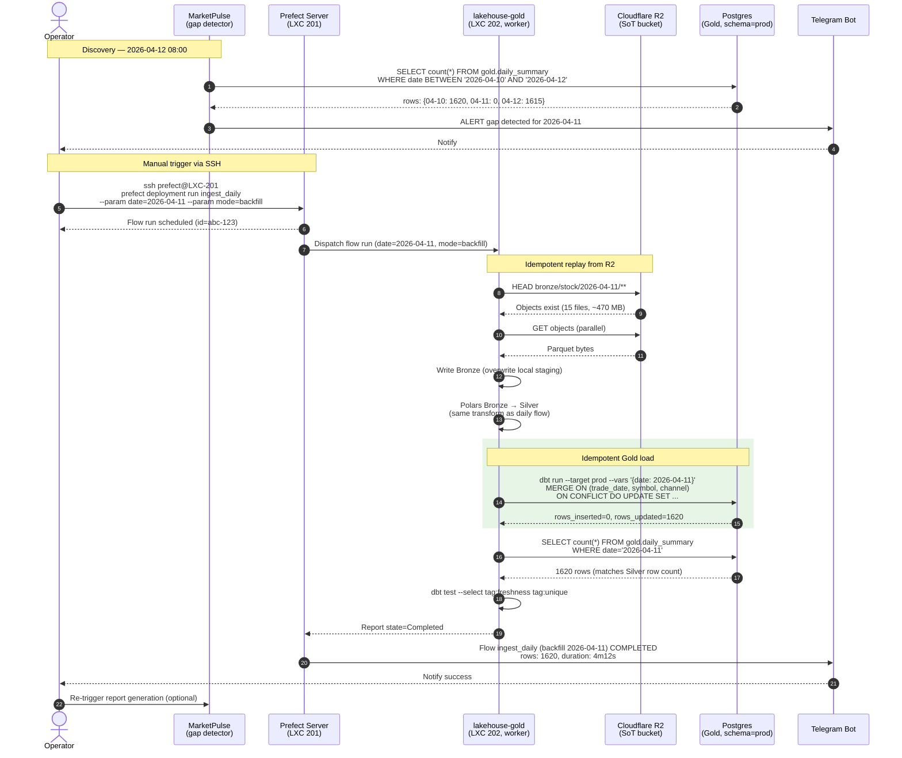

# Manual Backfill Flow (R2 Replay)

> Version: 1.0 | Last Updated: 2026-04-13 | Status: Draft

## Overview

Khi operator phát hiện gap ở Gold (ví dụ MarketPulse report thiếu ngày 2026-04-11), backfill bằng cách replay từ R2 với flag `--date=YYYY-MM-DD`. Flow đảm bảo idempotent qua `ON CONFLICT UPDATE` ở Postgres Gold.

## Sequence

## Notes

- **Timing SLA**: Backfill 1 ngày thường hoàn tất trong 4–6 phút (R2 download ~2m, Polars ~1m, dbt ~1m). Backfill > 7 ngày nên chunk theo batch để tránh OOM.
- **Idempotency guarantees** (D6 ADR):
  - Bronze: overwrite theo date partition (R2 object key làm natural key)
  - Silver: Parquet overwrite theo `date=YYYY-MM-DD` partition
  - Gold: `ON CONFLICT (trade_date, symbol, channel) DO UPDATE` — chạy lại nhiều lần không double-count
- **Failure modes**:
  - R2 HEAD trả 404 (bước 10) → flow fail ngay với message `NO_R2_DATA_FOR_DATE`, không tạo Bronze trống. Operator phải check bizfly WAL archive thủ công.
  - Silver row count mismatch với Gold (bước 18 vs Silver) → dbt test `unique_trade_date_symbol` fail → rollback bằng `DELETE FROM gold.daily_summary WHERE date='2026-04-11'` rồi re-run.
  - Gap > 7 ngày: dùng `--param mode=backfill_range --param start=... --param end=...` (loop internal).
- **References**: ADR-2026-04-13 (D3 R2 ingestion, D6 schema separation), `data-lakehouse/CLAUDE.md` (Quality Gate #3: Gold row count khớp Silver).
