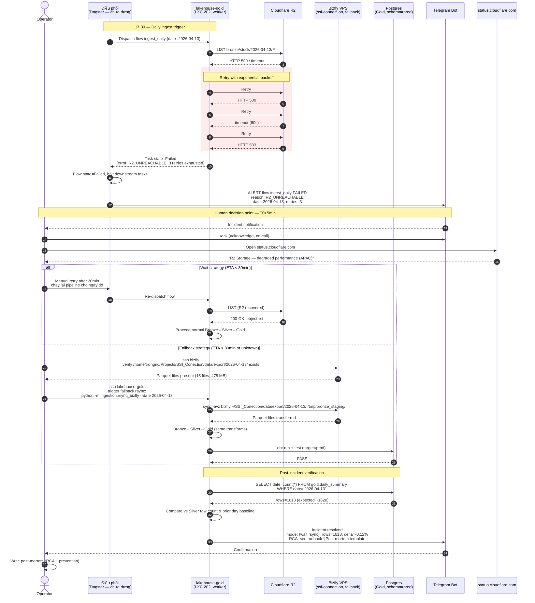

# Incident Response — Cloudflare R2 Unreachable

> Version: 1.0 | Last Updated: 2026-04-13 | Status: Draft

## Overview

Khi R2 không reachable tại thời điểm pull (17:30 ICT), flow retry với exponential backoff, fail soft sau 3 lần, alert operator. Operator quyết định wait-out hoặc fallback sang rsync trực tiếp từ bizfly. Post-incident verify data completeness.

## Sequence

## Notes

- **Timing SLA**:
  - Detection: T0 = 17:30 ICT (flow start), alert gửi lúc T0+~4m (sau 3 retries)
  - Acknowledge: trong 10 phút (operator on-call)
  - Resolution target: trước 20:00 ICT để MarketPulse catch up cùng ngày
- **Retry policy** (mục tiêu, khai ở tầng Dagster): 3 lần, delay [30, 60, 120] giây (exponential, capped). Không retry với lỗi 4xx (client error — fail fast).
- **Decision criteria wait vs fallback**:
  - Wait: CF status báo ETA recovery < 30 phút, < 15:00 UTC của cùng ngày
  - Fallback rsync: ETA > 30 phút, hoặc status không rõ, hoặc đã 19:00 ICT
- **Failure modes**:
  - Bizfly cũng unreachable → escalate user, không có path khác (single producer, P1 incident)
  - Rsync completed nhưng row count delta > 5% → dbt test `freshness` fail → treat as partial ingest, flag trong post-mortem
  - R2 recover nhưng dữ liệu 2026-04-13 chưa được bizfly upload xong → check bizfly cron log, có thể phải chờ hoặc force upload thủ công
- **Prevention followup**: xem xét dual-write bizfly → R2 + bizfly → lakehouse direct (nếu R2 outage lặp lại > 2 lần/quý). Tracked ở ADR backlog.
- **References**: ADR-2026-04-13 (D3 ingestion path), `ssi-connection` ADR-011 (R2 as SoT, bizfly là producer), `data-lakehouse/CLAUDE.md` (Production awareness — VPS 24/7).
