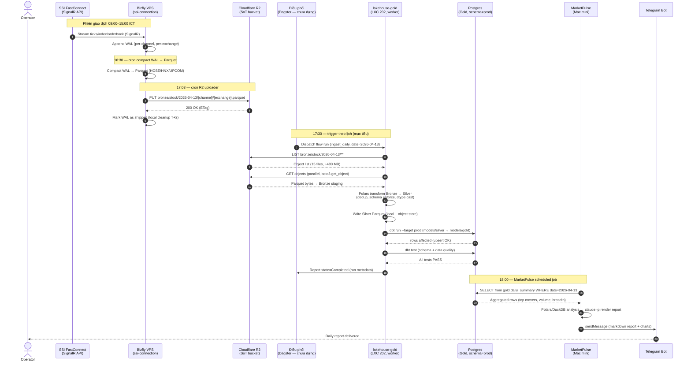

# End-to-End Ingestion Flow (Happy Path)

> Version: 1.0 | Last Updated: 2026-04-13 | Status: Draft

## Overview

Luồng ingestion hàng ngày từ SSI FastConnect → Bizfly VPS → Cloudflare R2 → lakehouse-gold (Bronze/Silver/Gold) → MarketPulse → Telegram. Flow này chạy mỗi phiên giao dịch, hoàn tất trước 18:00 ICT.

## Sequence

## Notes

- **Timing SLA**:
  - 17:03 ICT: R2 upload complete (bizfly cron, ssi-connection ADR-011)
  - 17:30 ICT: pipeline được trigger theo lịch (mục tiêu — hiện chạy tay)
  - 17:55 ICT: Gold tables ready (dbt run + test finish)
  - 18:00 ICT: MarketPulse report delivered
- **Idempotency**: Bronze uses R2 object key as natural dedup; Gold uses `ON CONFLICT (date, symbol, channel) DO UPDATE` theo ADR D3/D6.
- **Retention**: Bronze/Silver indefinite trên SeaweedFS; WAL trên bizfly T+2 ngày.
- **Failure modes**:
  - R2 timeout at step 14 → retry 3x exponential backoff → run state=Failed → xem `incident-r2-down.md`
  - Silver dedup drift > 5% → dbt test fail → flow fail + Telegram alert (không ghi Gold)
  - MarketPulse miss data → alert ở 18:05 nếu Gold rows < expected threshold
- **References**: ADR-2026-04-13 (D3 ingestion path, D4 Polars+dbt; orchestration → ADR 2026-08-05 Dagster), `data-lakehouse/CLAUDE.md` (quality gates), `ssi-connection` ADR-011 (R2 as SoT).
